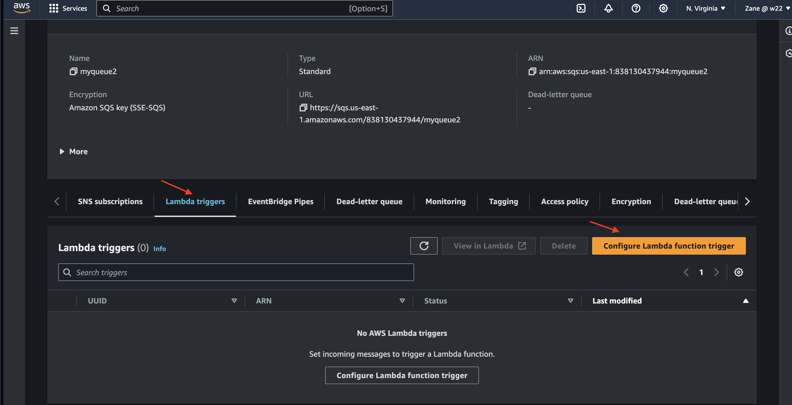

  # AWS Event-Driven Architecture

  __Project: Event-Driven Architecture with S3, SNS, SQS and Lambda on AWS__

**Overview**

This project showcases an implementation of an **event-driven architecture (EDA) on AWS.** 

This approach fosters scalability, loose coupling, and fault tolerance by leveraging asynchronous communication between services.

# Overview of Resources Utilized

**Amazon S3 Bucket:** An S3 bucket is created to store objects and trigger events based on object uploads.

**Amazon SNS Topic:** An SNS (Simple Notification Service) topic is created to publish messages and notify subscribed endpoints or other AWS services.

**Amazon SQS Queues:** SQS (Simple Queue Service) queues are created to store messages and decouple the components of the system.

**Lambda Functions:** Lambda functions are created to process events triggered by S3 uploads or messages sent to SQS queues.

**IAM Permissions:** IAM (Identity and Access Management) permissions are configured to grant appropriate access to the necessary AWS resources    for the Lambda functions and other components.

# step-by-step instructions for setting up the event-driven architecture on AWS:

# 1. Set Up Amazon S3 Bucket:

  Create an Amazon S3 bucket.

  Keep all Settings Default.

  
  
  

# S3 Event Notification Configureation

  Select s3 bucket, go to properties and choose event notification.

  Create event Notification.

  Enter event Name and choose Event Type.

  

  Select destination (snsTopic) and chosse from your sns Topic.
  
  # 

# 2. Create an Amazon SNS Topic:
 
  Create an Amazon SNS topic.

  

  # SNS configuration

  **SNS Access Policy**

  Edit Policy with provided sns access policy and save changes.
  
  

  **SNS Subscription**
  
  Create subscription For Queue1
  
  

  Create subscription For Queue2
  
  

 # 

  
# 3. Create Amazon SQS Queues:

   Create two Amazon SQS queues.

    
 
   Kepp all settings default and create Topic. Reemeber to do this on the second Topic.
 
 # 

 **SQS Access Policy**

 

 Repeat Thesame proceedure as for SNS and replace all itemin < >. and save Changes.

# Configure Lambda Function Trigger

Lambda Trigger is created for Queue1 and Queue2

Select the function that matches with queue 1

Select the function that matches with queue 2

lambda trigger for queue 1 Enabled 

lambda trigger for queue1 2Enabled 

  
# 4. Create Two Lambda Functions:
 
  Lambda functions to process events triggered by S3 uploads or messages sent to SQS queues.

  Ensure that Lambda functions are appropriately configured with the necessary permissions to interact with other AWS services.
  
  
  
  
  # 

  In the Code Section of your lambda function: replace line 4 of code = print(json.dumps(event)) and Deploy.Thses should be repeated on both        lambda function.

 # 
  

# 5. Configure IAM Permissions:

  Define IAM policies to grant appropriate permissions to Lambda functions.

  **Policy:**

  
  
  Select JSON and edit with the Lambda_Policy Provide.
  
  Replace all item in the <>. which includes region and so on. 
  
  This should also be repeated for the second Policy as show in the image below.

  **Policy 1**
  
  

  **Policy 2**
  

  Name and Create Policy 1
  

  Name and Create Policy 2
  

 # **IAM Role for Lambda function**
 
  Remember to Create 2 roles for your 2 Lambda functions.

  Repeat all Procedures for the second Lambda Role

  Select Role from IAM and create Role
  
  

  Select trusted entity and use Case
  
  

  Add Permissions : Choose from the the policy you created. 
  
  

  Name, Review and Create Role.
  
 # 
  

# 6. Test the System:

  Upload objects to the S3 bucket to trigger events to the SQS queues to test the event-driven architecture.
  
  Add File to your bucket
  
  

  Upload Sucessful 
  
  

  Confirm your SQS trigger and Select Monitor to view
  
  

  Select Cloudwatch to view Logs
  
  

  Select file in Log streams 
  
  

  Report:
  # 

**Copy objects to the S3 bucket to trigger events o the SQS queues to test the event-driven architecture.**

  Select file to be copied, Click Action and Choose Copy
  
  

  Destination for Copy is S3://<bucketname>/filename

  in this case is used /new/ as filename then select Copy
  
  

  Copy Confirmation
  
  

  Repeat procedure to confirm your sqs trigger and Select monitor to view Cloudwatch Log.

  Report:
  

  Monitor the system's behaviour to ensure that events are processed correctly and notifications are triggered as expected.
